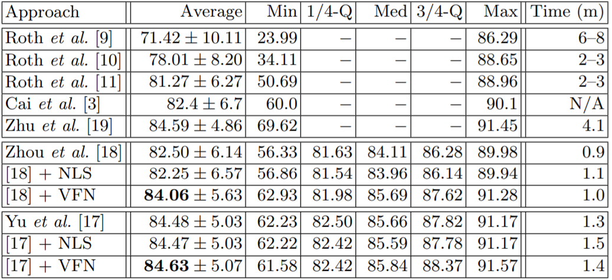

# VFN
Pytorch Implementation of **Volumetric Fusion Net** for volumetric segmentation of medical images. The key idea is that we first train three 2D networks from different views of CT scans (axial, sagittal and coronal), and then fuse the predictions with a relatively shallow and fast network (*VFN*).

[Bridging the Gap Between 2D and 3D Organ Segmentation with Volumetric Fusion Net](https://arxiv.org/abs/1804.00392)  
Yingda Xia1, Lingxi Xie1, Fengze Liu1, Zhuotun Zhu1, Elliot K. Fishman2, Alan L. Yuille1  
1Johns Hopkins University, 2Johns Hopkins Medical Institue  
In MICCAI 2018

## Results on NIH pancreas dataset

## Qualitative Analysis

